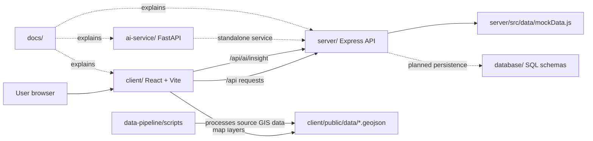

# BhuDrishti AI

BhuDrishti AI is an AI-enabled land intelligence platform for exploring land parcels, understanding risks and land use, testing policy scenarios, supporting verification, and bringing research data into one decision-support experience.

This repository contains the complete MVP: a React web client, an Express API, a small FastAPI AI service, GIS data-processing scripts, database schemas, and project documentation.

## What is implemented

- Land Explorer with map layers and parcel data
- Analytics dashboard
- LandCheck workflow
- AI Insights page and decision-support API
- Policy Simulation
- Verification workflow
- Research Hub
- Login, protected routes, user profile, and dashboard pages
- GeoJSON layers for parcels, land use, risk zones, climate risk, forests, infrastructure, and water bodies

The project is an MVP/demo. The Express API currently uses mock data, and PostgreSQL/PostGIS is the target persistence layer described by the SQL schemas. It is not an official legal land-record authority system.

## How the folders connect



### Request and data flow

1. The user opens the React application from `client/` at `http://localhost:5173`.
2. React pages and components use the modules in `client/src/api/` to call the backend.
3. Vite proxies `/api` requests to the Express server at `http://localhost:5000`.
4. Express mounts the route modules in `server/src/routes/`, applies authentication to protected groups, and returns the current mock data.
5. The client loads map layers directly from `client/public/data/`. The scripts in `data-pipeline/` can process or prepare those GIS files.
6. The frontend's current AI page calls the Express `/api/ai/insight` route. The separate FastAPI service in `ai-service/` provides its own `/health` and `/insights` endpoints and is ready to be integrated behind the backend.
7. `database/` contains the schema for the future persistent users, parcels, and audit-log database. It is not connected to the current MVP runtime.

## Repository structure

```text
bhudrishti-ai-mvp/
├── client/                         # React/Vite frontend
│   ├── src/
│   │   ├── api/                    # Axios clients for backend services
│   │   ├── components/             # Layout, map, analytics, and research UI
│   │   ├── context/                # Auth and land state
│   │   └── pages/                  # Application screens and routes
│   ├── public/data/                # GeoJSON files used by map layers
│   └── package.json
├── server/                         # Express backend API
│   ├── src/routes/                 # Auth, land, analytics, research, AI, etc.
│   ├── src/controllers/            # Request-handling logic
│   ├── src/middleware/             # Authentication middleware
│   ├── src/data/mockData.js        # Current demo data source
│   └── package.json
├── ai-service/                     # FastAPI AI decision-support service
│   ├── app/main.py                 # /health and /insights endpoints
│   └── requirements.txt
├── data-pipeline/                  # GIS processing utilities
│   └── scripts/process_geojson.py
├── database/                       # Planned persistence model
│   ├── schema.sql
│   └── schema/                     # Users, parcels, and audit logs
├── docs/                           # Project overview, architecture, and demo docs
└── README.md
```

## Frontend routes

The route definitions are in `client/src/App.jsx`.

| Route                | Access    | Purpose                        |
| -------------------- | --------- | ------------------------------ |
| `/`                  | Public    | Home page                      |
| `/land-explorer`     | Public    | Explore parcels and map layers |
| `/research`          | Public    | Research Hub                   |
| `/login`             | Public    | Sign in to the demo app        |
| `/analytics`         | Protected | Analytics dashboard            |
| `/land-check`        | Protected | LandCheck analysis             |
| `/ai-insights`       | Protected | AI decision support            |
| `/policy-simulation` | Protected | Policy scenario testing        |
| `/verification`      | Protected | Verification workflow          |
| `/dashboard`         | Protected | User dashboard                 |
| `/profile`           | Protected | User profile                   |

## Backend API groups

The Express application is configured in `server/src/app.js`.

- `/api/auth` - login and authentication
- `/api/lands` - land and parcel data
- `/api/analytics` - analytics data; protected
- `/api/research` - research data
- `/api/land-check` - land checks; protected
- `/api/ai` - AI-related API operations; protected
- `/api/simulation` - policy simulations; protected
- `/api/verification` - verification operations; protected
- `/api/health` - backend health check

The frontend uses `VITE_API_URL` when it is set. Otherwise it uses `http://localhost:5000/api`. The Vite development proxy means that the normal local setup does not require a frontend CORS configuration.

## AI service API

The FastAPI service runs separately on port `8000`.

- `GET /health` returns service status.
- `POST /insights` accepts `parcel_id`, `land_use`, and `risk_level` and returns a decision-support summary. This service is currently standalone; the frontend reaches the Express AI route instead.

Example request:

```bash
curl -X POST http://localhost:8000/insights ^
	-H "Content-Type: application/json" ^
	-d "{\"parcel_id\":\"P-001\",\"land_use\":\"agricultural\",\"risk_level\":\"medium\"}"
```

On macOS/Linux, replace `^` with `\` for line continuation, or run the command on one line.

## Prerequisites

- Node.js 18 or later
- npm
- Python 3.10 or later
- pip

## Run locally

Run each service in its own terminal from the repository root.

### 1. Backend API

```bash
cd server
npm install
npm run dev
```

Available at `http://localhost:5000`.

### 2. Frontend

```bash
cd client
npm install
npm run dev
```

Open `http://localhost:5173`.

### 3. AI service

```bash
cd ai-service
python -m venv .venv
```

Windows PowerShell:

```powershell
.\.venv\Scripts\Activate.ps1
```

macOS/Linux:

```bash
source .venv/bin/activate
```

Then install and start the service:

```bash
pip install -r requirements.txt
uvicorn app.main:app --reload --host 0.0.0.0 --port 8000
```

### 4. Optional GIS processing

```bash
cd data-pipeline
python scripts/process_geojson.py
```

The processed files used by the frontend belong in `client/public/data/`.

## Build and verify the frontend

```bash
cd client
npm run build
```

Health checks:

```bash
curl http://localhost:5000/api/health
curl http://localhost:8000/health
```

## Configuration

Create `client/.env` only when the backend is not running at the default URL:

```env
VITE_API_URL=http://localhost:5000/api
```

Do not commit secrets or local environment files. The current demo authentication stores its token in browser local storage under `bhudrishti_token`.

## Where to make changes

- UI, pages, navigation, and map behavior: `client/src/`
- Frontend API calls: `client/src/api/`
- Auth and shared client state: `client/src/context/`
- Express setup and middleware: `server/src/app.js` and `server/src/middleware/`
- API endpoints: `server/src/routes/`
- Backend request logic: `server/src/controllers/`
- Demo data: `server/src/data/mockData.js`
- AI behavior: `ai-service/app/main.py`
- GIS preparation: `data-pipeline/scripts/`
- Database design: `database/schema/`
- Architecture and product documentation: `docs/`

## Related documentation

- `docs/project/project-overview.md` - product and project context
- `docs/architecture/system-architecture.md` - architecture notes
- `docs/sih/demo-script.md` - demo flow
- `data-pipeline/README.md` - GIS pipeline notes
- `database/README.md` - database notes

## Current limitations

- Backend responses are mock/demo data.
- The SQL schemas are not yet connected to the Express server.
- The AI service is a lightweight decision-support stub, not a production model.
- Authentication is intended for the MVP and should be replaced with production identity, token storage, validation, and authorization before deployment.

## Project purpose

BhuDrishti AI brings land data, spatial layers, analytics, AI-assisted interpretation, verification, and policy simulation into one platform. It is intended to help teams explore evidence and evaluate decisions faster while keeping the MVP architecture easy to run and extend.
