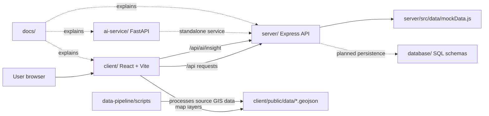

<<<<<<< HEAD
# BhuDrishti AI

BhuDrishti AI is an AI-enabled land intelligence platform for exploring land parcels, understanding risks and land use, testing policy scenarios, supporting verification, and bringing research data into one decision-support experience.

This repository contains the complete MVP: a React web client, an Express API, a small FastAPI AI service, GIS data-processing scripts, database schemas, and project documentation.

## What is implemented

- Land Explorer with map layers and parcel data
- Analytics dashboard
- LandCheck workflow
- AI Insights page and decision-support API
- Policy Simulation
- Verification workflow
- Research Hub
- Login, protected routes, user profile, and dashboard pages
- GeoJSON layers for parcels, land use, risk zones, climate risk, forests, infrastructure, and water bodies

The project is an MVP/demo. The Express API currently uses mock data, and PostgreSQL/PostGIS is the target persistence layer described by the SQL schemas. It is not an official legal land-record authority system.

## How the folders connect



### Request and data flow

1. The user opens the React application from `client/` at `http://localhost:5173`.
2. React pages and components use the modules in `client/src/api/` to call the backend.
3. Vite proxies `/api` requests to the Express server at `http://localhost:5000`.
4. Express mounts the route modules in `server/src/routes/`, applies authentication to protected groups, and returns the current mock data.
5. The client loads map layers directly from `client/public/data/`. The scripts in `data-pipeline/` can process or prepare those GIS files.
6. The frontend's current AI page calls the Express `/api/ai/insight` route. The separate FastAPI service in `ai-service/` provides its own `/health` and `/insights` endpoints and is ready to be integrated behind the backend.
7. `database/` contains the schema for the future persistent users, parcels, and audit-log database. It is not connected to the current MVP runtime.

## Repository structure

```text
bhudrishti-ai-mvp/
├── client/                         # React/Vite frontend
│   ├── src/
│   │   ├── api/                    # Axios clients for backend services
│   │   ├── components/             # Layout, map, analytics, and research UI
│   │   ├── context/                # Auth and land state
│   │   └── pages/                  # Application screens and routes
│   ├── public/data/                # GeoJSON files used by map layers
│   └── package.json
├── server/                         # Express backend API
│   ├── src/routes/                 # Auth, land, analytics, research, AI, etc.
│   ├── src/controllers/            # Request-handling logic
│   ├── src/middleware/             # Authentication middleware
│   ├── src/data/mockData.js        # Current demo data source
│   └── package.json
├── ai-service/                     # FastAPI AI decision-support service
│   ├── app/main.py                 # /health and /insights endpoints
│   └── requirements.txt
├── data-pipeline/                  # GIS processing utilities
│   └── scripts/process_geojson.py
├── database/                       # Planned persistence model
│   ├── schema.sql
│   └── schema/                     # Users, parcels, and audit logs
├── docs/                           # Project overview, architecture, and demo docs
└── README.md
```

## Frontend routes

The route definitions are in `client/src/App.jsx`.

| Route                | Access    | Purpose                        |
| -------------------- | --------- | ------------------------------ |
| `/`                  | Public    | Home page                      |
| `/land-explorer`     | Public    | Explore parcels and map layers |
| `/research`          | Public    | Research Hub                   |
| `/login`             | Public    | Sign in to the demo app        |
| `/analytics`         | Protected | Analytics dashboard            |
| `/land-check`        | Protected | LandCheck analysis             |
| `/ai-insights`       | Protected | AI decision support            |
| `/policy-simulation` | Protected | Policy scenario testing        |
| `/verification`      | Protected | Verification workflow          |
| `/dashboard`         | Protected | User dashboard                 |
| `/profile`           | Protected | User profile                   |

## Backend API groups

The Express application is configured in `server/src/app.js`.

- `/api/auth` - login and authentication
- `/api/lands` - land and parcel data
- `/api/analytics` - analytics data; protected
- `/api/research` - research data
- `/api/land-check` - land checks; protected
- `/api/ai` - AI-related API operations; protected
- `/api/simulation` - policy simulations; protected
- `/api/verification` - verification operations; protected
- `/api/health` - backend health check

The frontend uses `VITE_API_URL` when it is set. Otherwise it uses `http://localhost:5000/api`. The Vite development proxy means that the normal local setup does not require a frontend CORS configuration.

## AI service API

The FastAPI service runs separately on port `8000`.

- `GET /health` returns service status.
- `POST /insights` accepts `parcel_id`, `land_use`, and `risk_level` and returns a decision-support summary. This service is currently standalone; the frontend reaches the Express AI route instead.

Example request:

```bash
curl -X POST http://localhost:8000/insights ^
	-H "Content-Type: application/json" ^
	-d "{\"parcel_id\":\"P-001\",\"land_use\":\"agricultural\",\"risk_level\":\"medium\"}"
```

On macOS/Linux, replace `^` with `\` for line continuation, or run the command on one line.

## Prerequisites

- Node.js 18 or later
- npm
- Python 3.10 or later
- pip

## Run locally

Run each service in its own terminal from the repository root.

### 1. Backend API
=======
# BhuDrishti AI — Land Intelligence Platform

BhuDrishti AI ek AI-enabled land intelligence platform hai jo land governance, parcel analysis, policy simulation, risk assessment, aur research insights ko ek hi dashboard mein collect karta hai.

Is project ka primary purpose hai:

- land parcels ko explore karna
- risk aur land-use analysis karna
- policy scenarios simulate karna
- research aur verification support dena
- decision-making ko data-driven banana

---

## 1) Project ka simple understanding

Yeh project 6 major parts mein divide hai:

### Team 1 — Frontend / UX

Folder: `client/`

- React + Vite app
- UI pages, dashboards, map, navigation, forms
- User ka entry point hai
- Normal access URL: http://localhost:5173

### Team 2 — Backend API

Folder: `server/`

- Express.js server
- All APIs serve karta hai
- Frontend ke requests ko handle karta hai
- Base URL: http://localhost:5000

### Team 3 — AI Service

Folder: `ai-service/`

- FastAPI service
- AI-based insights and decision support
- Base URL: http://localhost:8000

### Team 4 — Data Pipeline / GIS Data

Folder: `data-pipeline/`

- GeoJSON processing and spatial dataset handling
- Land maps, risk zones, water bodies, infrastructure, parcels, forest area

### Team 5 — Database / Schema

Folder: `database/`

- SQL schema files
- User, land parcel, audit logs related data model

### Team 6 — Documentation / Architecture

Folder: `docs/`

- Architecture and project explanation
- Demo script and project overview

---

## 2) Project architecture

User UI -> Frontend (`client`) -> Backend API (`server`) -> AI Service (`ai-service`)

Simple flow is:

1. User browser frontend open karta hai
2. Frontend API calls backend server se
3. Backend data analytics, land check, verification, research APIs provide karta hai
4. AI service additional insights generate karta hai
5. GeoJSON / GIS files aur database files project ke datasets supply karte hain

---

## 3) Required tools

Before running project, make sure you have:

- Node.js 18+
- npm
- Python 3.10+
- pip

---

## 4) How to run the project locally

### Step 1: Start Backend

Open terminal in `server/` folder:
>>>>>>> 88285cb0337e627754bb5a5866bc258406f0e646

```bash
cd server
npm install
npm run dev
```

<<<<<<< HEAD
Available at `http://localhost:5000`.

### 2. Frontend
=======
Backend will run on:

- http://localhost:5000

Check health:

```bash
curl http://localhost:5000/api/health
```

---

### Step 2: Start Frontend

Open another terminal in `client/` folder:
>>>>>>> 88285cb0337e627754bb5a5866bc258406f0e646

```bash
cd client
npm install
npm run dev
```

<<<<<<< HEAD
Open `http://localhost:5173`.

### 3. AI service

```bash
cd ai-service
python -m venv .venv
```

Windows PowerShell:

```powershell
.\.venv\Scripts\Activate.ps1
```

macOS/Linux:

```bash
source .venv/bin/activate
```

Then install and start the service:

```bash
=======
Frontend will run on:

- http://localhost:5173

Open browser and go to:

- http://localhost:5173

---

### Step 3: Start AI Service

Open another terminal in `ai-service/` folder:

```bash
cd ai-service
>>>>>>> 88285cb0337e627754bb5a5866bc258406f0e646
pip install -r requirements.txt
uvicorn app.main:app --reload --host 0.0.0.0 --port 8000
```

<<<<<<< HEAD
### 4. Optional GIS processing
=======
AI service will run on:

- http://localhost:8000

Check health:

```bash
curl http://localhost:8000/health
```

---

### Step 4: Data pipeline (optional but important for GIS data)

Open terminal in project root or `data-pipeline/`:
>>>>>>> 88285cb0337e627754bb5a5866bc258406f0e646

```bash
cd data-pipeline
python scripts/process_geojson.py
```

<<<<<<< HEAD
The processed files used by the frontend belong in `client/public/data/`.

## Build and verify the frontend

```bash
cd client
npm run build
```

Health checks:

```bash
curl http://localhost:5000/api/health
curl http://localhost:8000/health
```

## Configuration

Create `client/.env` only when the backend is not running at the default URL:

```env
VITE_API_URL=http://localhost:5000/api
```

Do not commit secrets or local environment files. The current demo authentication stores its token in browser local storage under `bhudrishti_token`.

## Where to make changes

- UI, pages, navigation, and map behavior: `client/src/`
- Frontend API calls: `client/src/api/`
- Auth and shared client state: `client/src/context/`
- Express setup and middleware: `server/src/app.js` and `server/src/middleware/`
- API endpoints: `server/src/routes/`
- Backend request logic: `server/src/controllers/`
- Demo data: `server/src/data/mockData.js`
- AI behavior: `ai-service/app/main.py`
- GIS preparation: `data-pipeline/scripts/`
- Database design: `database/schema/`
- Architecture and product documentation: `docs/`

## Related documentation

- `docs/project/project-overview.md` - product and project context
- `docs/architecture/system-architecture.md` - architecture notes
- `docs/sih/demo-script.md` - demo flow
- `data-pipeline/README.md` - GIS pipeline notes
- `database/README.md` - database notes

## Current limitations

- Backend responses are mock/demo data.
- The SQL schemas are not yet connected to the Express server.
- The AI service is a lightweight decision-support stub, not a production model.
- Authentication is intended for the MVP and should be replaced with production identity, token storage, validation, and authorization before deployment.

## Project purpose

BhuDrishti AI brings land data, spatial layers, analytics, AI-assisted interpretation, verification, and policy simulation into one platform. It is intended to help teams explore evidence and evaluate decisions faster while keeping the MVP architecture easy to run and extend.
=======
This prepares or processes GIS geospatial data used in the app.

---

## 5) Main access points for all teams

### For frontend team

- Work in `client/src/`
- Main app route file: `client/src/App.jsx`
- UI pages under `client/src/pages/`
- Map and layout components under `client/src/components/`

### For backend team

- Work in `server/src/`
- Main server setup: `server/src/app.js`
- Routes under `server/src/routes/`
- Controllers under `server/src/controllers/`

### For AI team

- Work in `ai-service/app/`
- Main app: `ai-service/app/main.py`
- AI endpoints available under FastAPI app

### For GIS/data team

- Work in `data-pipeline/scripts/`
- GeoJSON files are under `client/public/data/`
- These data files drive map layers and land intelligence visualizations

### For database team

- Work in `database/schema/`
- Main SQL files under `database/schema/`
- Table design includes users, land parcels, audit logs

### For documentation/architecture team

- Work in `docs/`
- Use `docs/project/project-overview.md` and `docs/architecture/system-architecture.md`

---

## 6) Important folders and files

```text
bhudrishti-ai-mvp/
├── client/                  # Frontend React app
│   ├── src/
│   ├── public/data/         # GeoJSON datasets
│   └── package.json
├── server/                  # Backend Express API
│   ├── src/
│   └── package.json
├── ai-service/              # AI FastAPI service
│   ├── app/
│   └── requirements.txt
├── data-pipeline/           # GIS processing scripts
│   └── scripts/
├── database/                # SQL schema and database design
│   └── schema/
├── docs/                    # Project docs and architecture
├── README.md                # Project entry point
└── package-lock.json / etc.
```

---

## 7) Project features summary

- Land Explorer for parcel data
- Analytics dashboard for land trends
- AI Insights for decision support
- Policy Simulation for scenario testing
- Verification workflow for validation
- Research Hub with curated data and knowledge

---

## 8) Quick start for judges / teams

If you want to run the whole app quickly:

```bash
cd server && npm install && npm run dev
cd client && npm install && npm run dev
cd ai-service && pip install -r requirements.txt && uvicorn app.main:app --reload --host 0.0.0.0 --port 8000
```

Then open:

- Frontend: http://localhost:5173
- Backend: http://localhost:5000
- AI service: http://localhost:8000

---

## 9) Note

This project is built as a demo / hackathon MVP and is designed for land intelligence and governance support. It is a decision-support platform, not an official legal land authority system.

---

## 10) Final purpose

Yeh project ek unified platform hai jahan:

- UI user ko experience deta hai
- API backend logic ko support karta hai
- AI service insight generate karta hai
- Data pipeline GIS datasets supply karta hai
- Database project information store karta hai
- Documentation sab ko samajhne ke liye help karta hai

Agar aapko project ko samajhna hai, toh sabse pehle `client` ko open karke frontend dekhna, phir `server` API ko understand karna, aur last mein `ai-service` aur `data-pipeline` ko inspect karna best approach hai.

---

## 11) Useful commands summary

```bash
# Frontend
cd client
npm install
npm run dev

# Backend
cd server
npm install
npm run dev

# AI service
cd ai-service
pip install -r requirements.txt
uvicorn app.main:app --reload --host 0.0.0.0 --port 8000

# Data pipeline
cd data-pipeline
python scripts/process_geojson.py
```

This README is designed to help all 6 teams understand project structure, access points, and how the full app connects together.
>>>>>>> 88285cb0337e627754bb5a5866bc258406f0e646
